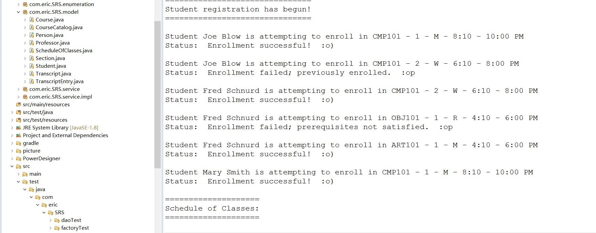
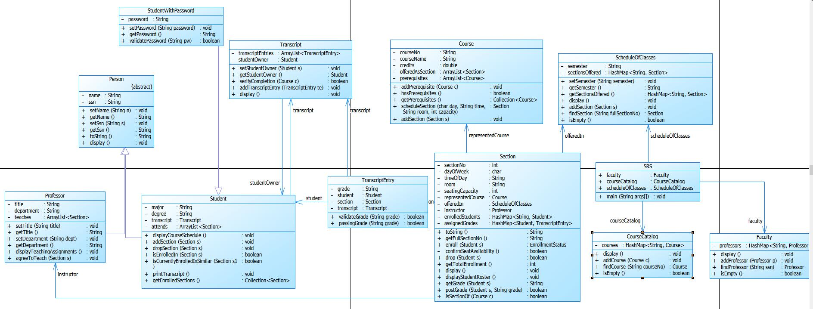
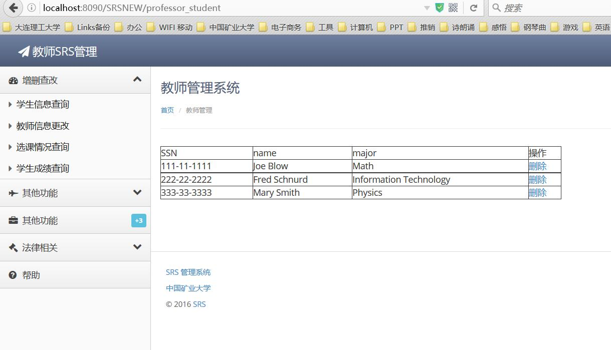
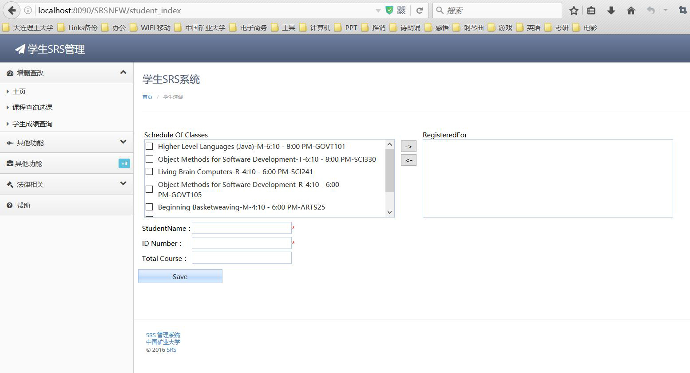

# SRS
1. 通过阅读《begining java object：从概念到代码》整本书，对List、Map、Set等几种对象集合有了基本的认识，对继承、封装、多态有了更加深刻的认识，学会了如何面向接口编程，降低代码间的耦合。

2.使用OOA&D构建SRS系统。

   采用Struts2+Hibernate+Spring4的方式进行整合开发，构建了选课SRS系统。
  
3.根据书中示例类图(P430)构建系统领域模型并实现测试
!

4.使用（PD或visio）画出你所实现的系统领域类图和至少两个关键场景的顺序图。

###领域类图
![领域类图]

###关键顺序图
###选课

###显示课时计划

5.采用三层结构实现基于web的SRS系统，后台采用sqlite为数据存储

  
  
  三层结构分别为数据访问层com.eric.SRS.dao(com.eric.SRS.dao.impl)，领域逻辑层com.eric.SRS.model\com.eric.SRS.service(com.eric.SRS.service.impl)，表示层com.eric.SRS.action。数据访问层采用Hibernate，利用Spring统一托管，动态加载properties数据，通过加载sqlite转换文件可以实现mysql、sqlite之间的任意切换。
  
6.可以采用guitar销售V3的系统架构也可以自行选择，但要求业务逻辑主要由model完成，数据源可切换

  
   
  业务逻辑依托model层，通过model和service形成领域逻辑层。数据访问层采用Hibernate，动态加载properties数据，可以实现mysql、sqlite之间的任意切换。
  
7. 数据结构请根据需要持久化的对象进行设计，给出数据库结构（表）的截图。
    
  数据结构通过Hibernate注解标注model实体类，实现了类与数据的分离，借助ORM工具持久化类。
  
8.至少需要实现的功能：学生登录、课程查询并选课（模型实现选课逻辑），课程、教师增删查改，学生成绩查询，课程选课情况查询（哪些人选了）
###登陆
    ![database]
###教师增删查改
![database]
###学生选课
![database]